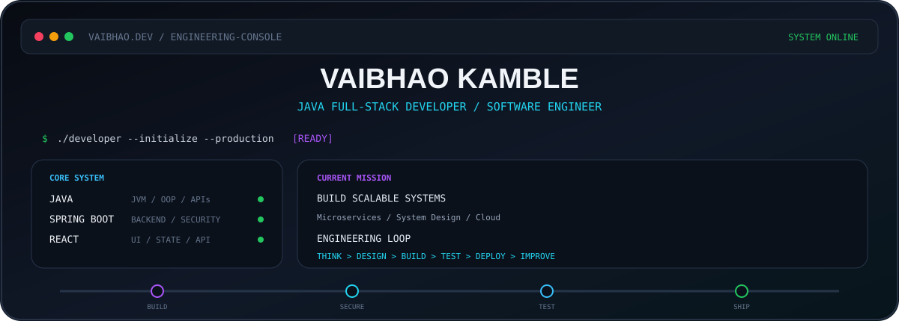
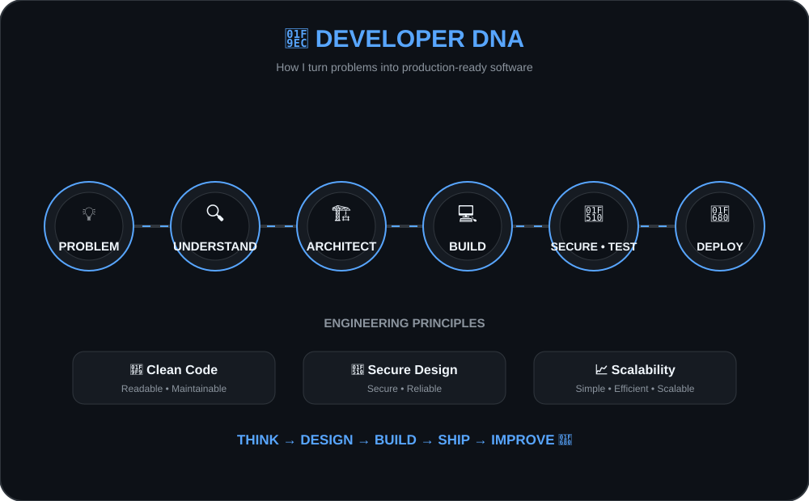
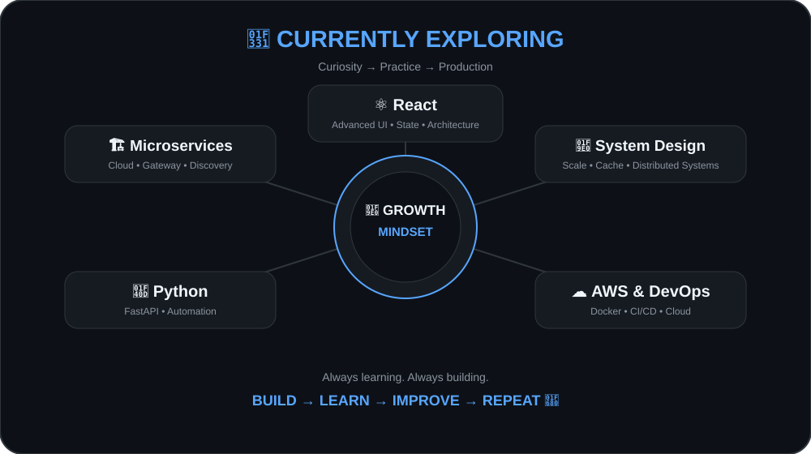

<div align="center">

<!-- ==================== HEADER ==================== -->



</div>

<br/>

# 👋 Hey, I'm Vaibhao Kamble

### ☕ Java Full-Stack Developer

---

<div align="center">


</div>

---

<!-- ==================== DEVELOPER DNA ==================== -->

<div align="center">



</div>

---

<!-- ==================== LEARNING ==================== -->

<div align="center">



</div>

---

<!-- ==================== TECH ARSENAL ==================== -->

<div align="center">



</div>

---

<!-- ==================== DEVELOPER TERMINAL ==================== -->

<div align="center">



</div>

---

## 🚀 Featured Projects

### 📋 Task Management System

Java + Spring Boot + Spring Security + JWT + MySQL

[View Repository](https://github.com/vaibhaokamble/TMSBackend)

### 🍔 Food Ordering Management System

Java + JSP + Servlet + MySQL

### 🎓 Student Result Management System

Java + JSP + Servlet + MySQL

### 🏨 Hotel Booking Management System

Java + Spring Boot + MySQL

---

<!-- ==================== GITHUB ANALYTICS ==================== -->

## 📊 GitHub Analytics

<div align="center">


<br/><br/>


</div>

---

## 📈 Contribution Activity

<div align="center">


</div>

---

## 🎯 2026 Mission

```text
React
  ↓
Microservices
  ↓
System Design
  ↓
Docker + AWS
  ↓
Production-Grade Applications
